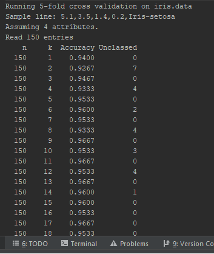
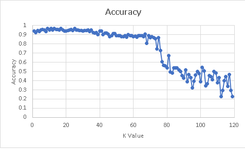

# machine-learning-knn

# K-NN Algorithm
A simple KNN implementation for CS7267. Handles csv formatted files of decimals followed by a class string.  

## Design
This includes code for reading the data, building the KNN model, and doing cross validation. Specific details are included in each file's writeup. 

Usage is via commandline as detailed in Main, but consists of either running a CrossValidation on a single file, or on building a model and then classifying a second file.

## Output
Sample output for the cross validation routine is below.

And the following graph shows accuracy as K increases.

### Main
Main.java is essentially a harness for the KNN modeling class.  As per the doc, there are three uses:

1. args like: "cv-auto" "iris.data" "5" "120"  
Argument 1 instructs the harness to run the Cross Validation. Argument 2 points to the data file to use for CV.  Argument 3 gives the number of folds to use in Cross Validation. Argument 4 gives the highest number of Ks to check.

1. args like: "iris_train.data" "4" "iris_test.data" "5"  
Creates knn-model using iris_train.data and 4 attributes, then run classification on iris_test.data with k-value of 5.

1. args like: ""  
Requests input from the user, asking sequentially for arguments as in case 2 above.

### DataStore
The DataStore class should be pointed at a CSV file with any number of decimal attributes followed by the class. Upon creation, the file will be read, and DataPoints will be created. Once the file is read, the data is scanned for highest and lowest values per attribute, then used to normalize all of the contained datapoints into a second DataPoint list.

A populated DataStore can be given a list of integers and used to return a subset of DataPoints in a new DataStore object. This is useful to handle Cross Fold validation.

### DataPoint
DataPoint.java contains the information for a single data point. This includes a list of decimal attributes, the known and predicted dataclasses if calculated, and a flag to indicate that this datapoint has been normalized.

### KNN
Knn.java handles the actual KNN model. A DataStore object is fed to the KNN class, then the class can take inputs of individual datapoints, formatted files, or a second datastore object.

### KnnCrossValidator
KnnCrossValidator.java does a simple cross validation of a DataStore using the KNN class.  